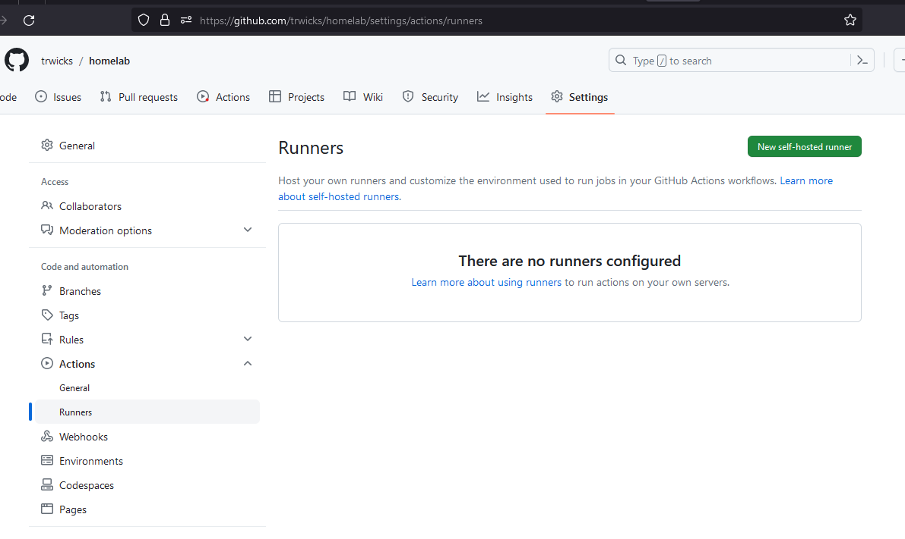

# 1 - Initial Setup

# Goal

Setup an Azure Devops environment, secrets management and runner that has access into the homelab. 

# Steps 

- Use the command line
- List and install dependencies
- Create VM template to use on proxmox
    - Setup new user in Proxmox
    - Generate and save SSH key for that user to use
    - Create the runner VM
- Install and configure a Github Runner
- Run a workflow 

## Using the command line

Being comfortable with the command line using either a linux shell and powershell will serve you well in performing a variety of tasks in different computing environments. 

I would say that the command line is very necessary if you want to easily record of how you achieved some task as you can copy and paste the commands into a wiki. And so often I have fondly remembered other admins and developers how have left well explained commands in a wiki that have worked near perfectly a few years after they were initially written.

## List and Install dependencies

What are the tools we need to achieve this part of the project?

To create VM template in Proxmox we are going to need an SSH client. I am going to use Windows Subsystem for Linux, using Ubuntu, for this task.

## Create a VM in Proxmox

### Create the User

```bash 
GROUP=homelabbers
USER=homelab

groupadd $GROUP
pveum groupadd $GROUP -comment "Homelab Admins"
pveum acl modify / --roles Administrator --group $GROUP

useradd -g $GROUP -m $USER
usermod 
passwd $USER
pveum user add $USER@pam
pveum user list
pveum usermod $USER@pam -group $GROUP

visudo

# change line %sudo ALL=(ALL:ALL) ALL to %sudo ALL=(ALL:ALL) NOPASSWD: ALL
```

### Copy Your SSH Key to Proxmox

```
PROXMOX_HOST=192.168.1.10
ssh-copy-id homelab@$PROXMOX_HOST
```

### Create the VM Template

```
sudo su

rm /etc/apt/apt.conf.d/10pveapthook
rm /etc/apt/sources.list.d/pve-enterprise.list

echo "deb https://enterprise.proxmox.com/debian/pve bullseye pve-enterprise" | tee /etc/apt/sources.list.d/proxmox.list
echo "deb http://security.debian.org/debian-security/ bullseye-security main" | tee /etc/apt/sources.list.d/proxmox.list
echo "deb http://download.proxmox.com/debian/pve bullseye pve-no-subscription" | tee /etc/apt/sources.list.d/proxmox.list

apt update 
apt install -y libguestfs-tools python3-pip 
pip3 install -U proxmoxer

IMG_URL=https://cloud.debian.org/images/cloud/bullseye/20230802-1460/debian-11-generic-amd64-20230802-1460.qcow2
# From https://cloud.debian.org/images/cloud/bullseye/20230802-1460/
wget -O /tmp/debian-server.img $IMG_URL
virt-customize -a /tmp/debian-server.img --install qemu-guest-agent
qm create 9000 --memory 2048 --name debian-cloudimage \
    --net0 virtio,bridge=vmbr0

qm importdisk 9000 /tmp/debian-server.img local-lvm
qm set 9000 --scsihw virtio-scsi-pci --scsi0 local-lvm:vm-9000-disk-0

qm set 9000 --ide2 local-lvm:cloudinit
qm set 9000 --boot c --bootdisk scsi0
qm set 9000 --serial0 socket --vga serial0
qm template 9000
```

### Create the Runner


```bash
# Generate an SSH Key
mkdir -p keys
( cd keys && ssh-keygen -t ecdsa -f homelab )

sudo su
VM_ID=9100

qm clone 9000 $VM_ID \
    --name runner \
    --full
qm set $VM_ID --cores 2 --memory 4096
qm set $VM_ID --ipconfig0 ip=192.168.1.15/24,gw=192.168.1.1

qm set $VM_ID --sshkey homelab.pub
qm set $VM_ID --nameserver 1.1.1.1 
qm set $VM_ID --ciuser admin
qm resize $VM_ID scsi0 +50G
qm start $VM_ID
```

```bash
# Copy your key from Proxmox
scp homelab@$PROXMOX_HOST:~/homelab .

# Check you can ssh to the VM
ssh -i homelab admin@192.168.1.15
```

### Install the Github Runner Software

For this example I will use the installation instructions provided by Github. These instructions are found by navigating to the Settings > Actions > Runner page in your repository and selecting "New self-hosted runner".




On the following page grab the download and configuration commands and run those command on the Proxmox VM runner.


```bash
mkdir actions-runner && cd actions-runner
curl -o actions-runner-linux-x64-2.308.0.tar.gz -L https://github.com/actions/runner/releases/download/v2.308.0/actions-runner-linux-x64-2.308.0.tar.gz
tar xzf ./actions-runner-linux-x64-2.308.0.tar.gz
./config.sh --unattended --labels homelab --url https://github.com/trwicks/homelab \
    --name homelab-runner --token <token>

sudo ./svc.sh install
sudo ./svc.sh start
sudo ./svc.sh status
```

If this has worked correctly the runner should be in an idle state.


### Run a Github Action using the Runner

Lastly, I want to create a Github Action to use the runner to run some simple commands.

The follow script created in the .github/workflows directory.

```yaml
name: project-1-initial-setup
on: 
  schedule:
    - cron: '*/5 * * * *' # every 5 mins
jobs:
  just-some-commands:
    runs-on: 
      labels: homelab
    steps:
      - uses: actions/checkout@v3
      - run: ip addr; whoami
```

From the Github Action console the Workflow should have been successfully run and outputs from the commands are displayed.

